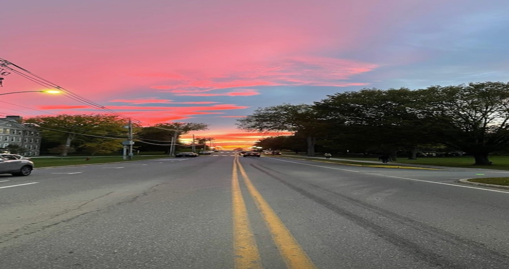

# Middlebury Sunsets!

{#id .class width=30% height=50%}

Middlebury is known for having one of the most *exquisite* sunsets!   
Read on to find out the different average times the sun sets in Middlebury during different times of the year, and the colors mostly displayed, in order to **not miss out** on the splendor!       

## So When Does The Sun *Actually* Set?!

Months with similar sunset times | Average Sunset Time | Colors Mostly Displayed 
-------------------------------- | ------------------- | ---------------------------
November - January               | 4:20 pm             | pink, orange, purple
February - March                 | 5:15 pm             | pink, orange, purple
April - May                      | 7:15 pm             | pink, light blue, orange 
June - August                    | 8:20 pm             | orange, red, array of blues

### Fun Things You Can Do While Watching the Sunset

1. Take pictures!
   + Use the sunset as a backdrop to an awesome picture
   + Pictures are always a great way to capture memories
2. Have a sunset picnic with friends
   + Especially during the summer, when it is way too hot during the times preceding the sunset.
3. Have a sunset walk!
   + This could be a great way to reflect on your day while taking in the slendid views of the sunset.

**Fun Equation:** Distance between the Earth and the sun
$$r_1 = 3\sqrt\frac{GMT^2}{4pi^2}$$
[Click here for more information!](https://www.agoldlining.com/post/reasons-why-you-should-make-time-for-the-sunset#:~:text=Research%20shows%20that%20sunsets%20have,a%20reason%20to%20go%20outside.) 

`Now it's time to put all this into action`
